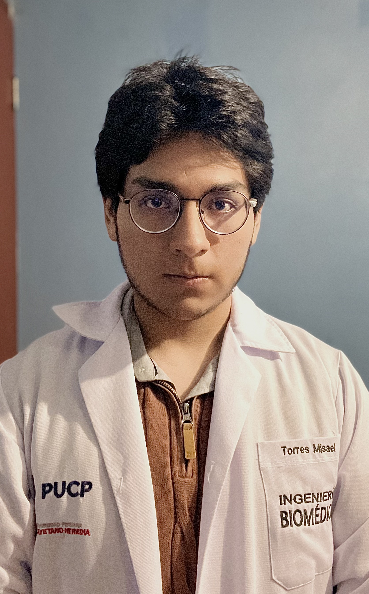

  

---
# Proyecto de FUNBIO - Equipo 4 ☕️

¡Bienvenidos! Somos el Grupo 4 del Curso de Fundamentos de Biodiseño, Código: 1CAY41, dictado
en el semestre 2024-2 por la carrera de Ingeniería Biomédica PUCP - UPCH

## Temática de nuestro horario 📜

Lesiones Medulares

## Link de nuestro repositorio 🔗

 : github.com/Misancio-T/FUNBIO---GRUPO-4.git

## Nos presentamos... 🔥

<h3>ANGIE HUÁNUCO VÁSQUEZ (Coordinadora General)</h3>

> 

> <h4> Me presento</h4>
>
> 
 Soy estudiante de Ingeniería Biomédica con interés en el desarrollo y mejora de dispositivos médicos que permitan mejorar las condiciones de vida de las personas.  

> <h4> Rol en el equipo</h4>
> 
 Mi rol durante el curso es de Coordinadora General. Soy responsable de supervisar el avance del proyecto en su totalidad, asegurando que cada fase se ejecute según el plan establecido. Coordino las tareas entre los diferentes miembros del equipo, facilitando la comunicación y resolviendo cualquier problema que pueda surgir. Además, me encargo de la planificación de reuniones y la elaboración de los 'entregables' respecto al progreso del proyecto. 

> <h4> Rama de interés</h4>
> 
 Procesamiento de señales e imágenes biomédicas. 

<h3>Misael Torres Bautista (Diseñador 3D)</h3>

> 

> <h4> Me presento</h4>
>
> 
 Soy estudiante de Ingeniería Biomédica en la Pontificia Universidad Católica del Perú y la Universidad Peruana Cayetano Heredia. Busco desarrollar dispositivos médicos para mejorar la salud en el Perú. Mi objetivo es usar los conocimientos adquiridos a lo largo del curso para aplicar estas herramientas en un futuro.  

> <h4> Rol en el equipo</h4>
> 
 Mi rol en este proyecto es el de Diseñador 3D. Soy responsable de crear los modelos 3D basados en los bocetos y propuestas de solución desarrolladas por el equipo. Utilizo herramientas como INVENTOR, BLENDER, CINEMA 4D Y ULTIMAKER CURA para diseñar y preparar los modelos para su impresión. También me encargo de gestionar y actualizar el repositorio de GitHub del equipo.  

> <h4> Rama de interés</h4>
> 
 Ingeniería de tejidos y la biomecánica. 

<h3>Silvana Villegas Berrocal (Manufactura Digital)</h3>

> 

> <h4> Me presento</h4>
>
> 
 Soy estudiante de Ingeniería Biomédica. Mi objetivo es la investigación de los cambios del cuerpo humano en diferentes ambientes para maximizar las capacidades físicas. 

><h4> Rol en el equipo</h4>
> 
 Mi rol es diseñar y gestionar los procesos de manufactura digital, asegurando la calidad y precisión en la creación de prototipos. 

> <h4> Rama de interés</h4>
> 
 Ingeniería molecular y celular así como sistemas biológicos. 

<h3>Sydnee Yampara Mamani (Prototipo Electrónico)</h3>

> 

> <h4> Me presento</h4>
> 
 Soy estudiante de ing biomédica con objetivo de innovación e ideas de tecnología relacionada a la salud para la implementación descentralizada de equipos médicos y detección no invasiva de las distintas enfermedades. 

> <h4> Rol en el equipo</h4>
> 
 Mi rol es diseñar y desarrollar prototipos electrónicos, incluyendo la selección de componentes y la integración de circuitos, para asegurar su funcionalidad y rendimiento. 

> <h4> Rama de interés</h4>
> 
 Ingeniería clínica e ingeniería de tejidos. 

<h3>William Zamalloa Quispe (Diseño electrónico)</h3>

> 

> <h4> Me presento</h4>
> 
 Soy estudiante de ingeniería biomédica, poseo interés en la mejora y desarrollo de prótesis para el cuerpo humano, espero trabajar con prótesis sencillas y funcionales y con algunas más complejas y especializadas. 

> <h4> Rol en el equipo</h4>
> 
 Mi rol es diseñar circuitos electrónicos utilizando software especializado, creando esquemas detallados y simulaciones para asegurar la eficiencia y funcionalidad de los prototipos. También administro y actualizo el repositorio de GitHub del equipo remotamente. 

> <h4> Rama de interés</h4>
> 
 Biomecánica y desarrollo de prótesis avanzadas. 

